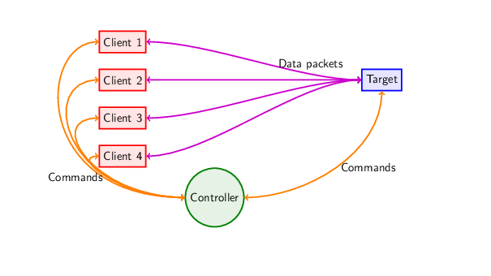

# ipbench
A benchmark suite for repeatable and reliable testing of IP networks. 

Getting started? See [SETUP.md](SETUP.md)
## What is ipbench?

ipbench is an extensible and reliable benchmarking suite we created in response to some common problems we saw with existing IP benchmark software.

### Main goals

1. Distributed operation : We want multiple clients able to perform the same test a target machine.  We want to be able to get the results reliably and consistently without resorting to hacking sh and perl scripts to munge data around.
2. No "heavyweight" server : Most existing network benchmark suites assume that both ends of the test are complete operating systems, with BSD socket support and POSIX compliance.  Experimental operating systems often don't meet these requirements.
3. Extensibility : We want to be able to add new and varied tests easily.
4. There aren't that many benchmark suites around : many paper authors resort to writing their own benchmarks, creating problems with repeatability and reliability of results.

### Architecture

The test suite has three main components:

1. **A controller** : Your personal computer
2. **n clients** : A "heavyweight" PC on which the test will run
3. **A target** : depending on the test requires different capabilities.

The general procedure is that you specify the test and the controller sets up and sychronously starts the client machines running their test aimed at the target.  Once they have completed, they report their results back to the controller, which concatenates the results from all clients and reports a final tally.

Some tests have a companion component that runs on the target, such as a CPU usage monitor.  These are optional but work similar to the testing clients.

### Implementation

The infrastructure is written in Python for maintainability, and the tests are written as plugins in C for speed.  There is a simple API for writing new tests should you wish to.

## Tests

### Latency test

We have instrumented a latency test which we belive is one of the most flexible latency tests available.

For documentation on the latency test see this page

### NFS test

We have a beta stage distributed NFS test included in the distribution.

### CPU usage

We have implemented an accurate CPU usage meter that can be run on the target machine.

### Wrapper Test

Using simple shell scripts called by ipbench you can very quickly extend the operation of ipbench.  For example, wrapper scripts around oprofile can automatically return kernel profiling information from your target machine during a run.

## Authors

Peter Chubb

## Contributers

Christopher Irving (documentation improvements)
Matthew Rossouw (move to GitHub, QoL and 2.1)
Ian Wienand (legacy)
Luke Macpherson (legacy, CPU measurement systems)

